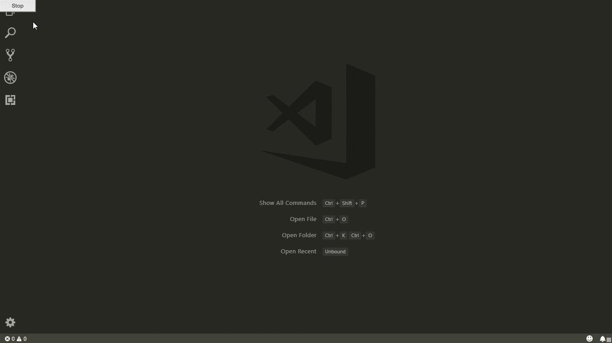

# Map Preview for VS Code

This extension provides a map preview of a location using [Open Street Map](https://openstreetmap.org).

## Usage

On the command palette select `Maps: Preview location`, then enter a location in the format `<latitude>,<longitude>`.

